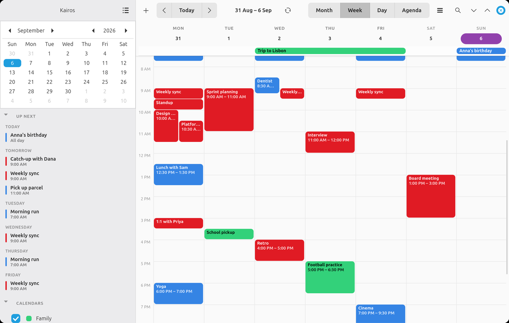

<div align="center">


# Kairos

**A lightweight, open source, customizable calendar for Linux.**

[](https://github.com/theophilustex/kairos/actions/workflows/ci.yml)
[](LICENSE)
[](https://www.python.org/)
[](https://gtk.org/)
[](docs/calendars.md)
[](docs/contributing.md)
[](docs/installation.md)
[](docs/security.md)


</div>

---

Written in Python with GTK 4 and libadwaita. It talks to any CalDAV/WebDAV
server — Nextcloud, Radicale, Fastmail, Posteo, your own box — and reads and
writes your events there.

It is meant to feel like GNOME Calendar, but to be small enough that you can
read the whole thing in an afternoon and change the bits you disagree with.

* **Free software** — GPL-3.0-or-later, no telemetry, no accounts, no network
  traffic except to the calendar servers you configure.
* **Read *and* write CalDAV/WebDAV**, with proper conditional writes.
* **Google too**, signed in with OAuth — your password goes to Google's own
  page, never through Kairos.
* **Works offline.** Everything is drawn from a local cache; changes queue up
  and go out on the next sync.
* **Reminders you cannot miss** — a notification *and* an alert window that
  comes to the front, at any offset you like: ten minutes, five days, two
  weeks. Snooze or dismiss.
* **Stays out of the way.** Closing the window leaves Kairos in the taskbar so
  reminders still arrive. It can start with your session.
* **Customisable** through a plain JSON settings file and your own CSS, which
  reloads the moment you save it.
* **Light.** About 7,000 lines of heavily commented Python (5,300 of actual
  code), four runtime dependencies, one SQLite file, and a single timer for
  all your reminders.
* **Runs as an AppImage** if you would rather not install anything.

---

## Install

```sh
# Debian / Ubuntu / Linux Mint
sudo apt install python3-gi python3-gi-cairo gir1.2-gtk-4.0 gir1.2-adw-1 \
                 gnome-keyring
pip install -r requirements.txt

make check-deps       # says what is missing, if anything
make install          # into ~/.local
kairos
```

Fedora, Arch, openSUSE, the AppImage, and running straight from a checkout are
all in **[docs/installation.md](docs/installation.md)**.

Then press <kbd>Ctrl</kbd>+<kbd>L</kbd> to connect a calendar account.

---

## Documentation

Full documentation is in **[docs/](docs/)**.

| | |
|---|---|
| [Installation](docs/installation.md) | Every distribution, the AppImage, the command line. |
| [User guide](docs/user-guide.md) | Views, events, reminders, background running, shortcuts, gestures. |
| [Calendars and accounts](docs/calendars.md) | Server addresses, offline behaviour, conflicts. |
| [Configuration](docs/configuration.md) | Every setting, and styling Kairos with your own CSS. |
| [Troubleshooting](docs/troubleshooting.md) | When something does not work. |
| [Architecture](docs/architecture.md) | How the code fits together, and how to extend it. |
| [Security](docs/security.md) | What is protected and how. |
| [Packaging](docs/packaging.md) | Installing, the AppImage, the icon. |
| [Contributing](docs/contributing.md) | Tests, style, and what a good change looks like. |

---

## A tour in one screen

Four views — month, week, day and agenda — switchable with
<kbd>Ctrl</kbd>+<kbd>1</kbd>…<kbd>4</kbd> or by swiping. Click an event for its
details; click empty space to pick a slot and again to create there.
<kbd>Ctrl</kbd>+<kbd>F</kbd> searches titles, places and notes, and opens
what you pick in the week view.

| | |
|:--:|:--:|
|  |  |
| **Week** — real times, overlaps side by side, a line at now | **Agenda** — a plain list, empty days skipped |
|  |  |
| **Search** — titles, places and notes, upcoming first | **The editor** — repeats and any number of reminders |

The sidebar shows a month, an **Up next** list of what is coming with each
event's colour and time, and your calendars — each of which can be hidden or
recoloured. Both lists fold away if you would rather have the space.

Reminders are per event, at any offset, and arrive as both a desktop
notification and a window that asks to be brought to the front — because a
notification that slides away after four seconds is very easy to miss. Snoozes
survive a restart.

Everything is drawn from a local SQLite cache, so it is instant and works on a
train. The network happens on a background thread; changes you make offline are
queued and pushed on the next sync, and a refresh from the server will never
discard an edit you have not managed to send.

Light or dark, and any accent colour you like:



More in the **[user guide](docs/user-guide.md)**.

---

## Security in brief

Passwords go to the system keyring, never to a Kairos file — and if there is no
keyring, Kairos says so rather than quietly writing one to disk. Plain http is
refused unless you enable it *and* the host is on your own network. TLS is
verified. Config files are `0600` and written atomically. Every SQL statement
uses bound parameters. There is no `eval`, no `pickle`, and no outbound traffic
beyond your own servers.

The details, and where to look in the code, are in
[docs/security.md](docs/security.md).

---

## Tests

```sh
make test
```

706 tests, standard-library `unittest`, no framework to install. The CalDAV
suite starts a real [Radicale](https://radicale.org) server on localhost and
drives the backend against it — create, read back, update in place, delete,
ETags, a genuine 412 conflict, and the offline queue. It skips cleanly if
Radicale is not installed:

```sh
pip install radicale
```

The suite never touches your real settings, cache or keyring.

---

## Known limitations

Kairos is a calendar for one person, not a groupware client. It does not do
invitations, attendees, free/busy or tasks. The full list is in
[the user guide](docs/user-guide.md#what-kairos-does-not-do).

---

## Licence

GPL-3.0-or-later — see [LICENSE](LICENSE).

Kairos depends on [caldav](https://github.com/python-caldav/caldav),
[icalendar](https://github.com/collective/icalendar),
[recurring-ical-events](https://github.com/niccokunzmann/python-recurring-ical-events)
and [keyring](https://github.com/jaraco/keyring), all free software, plus GTK 4
and libadwaita.
