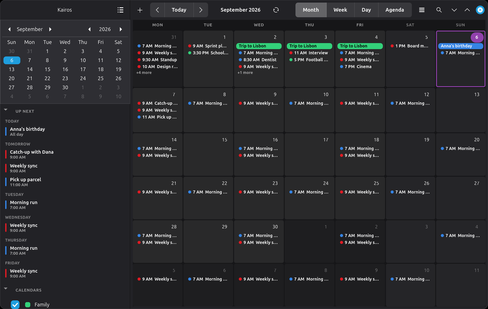
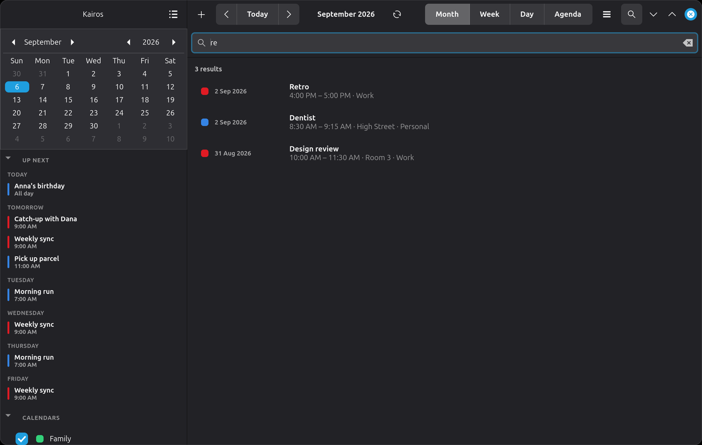
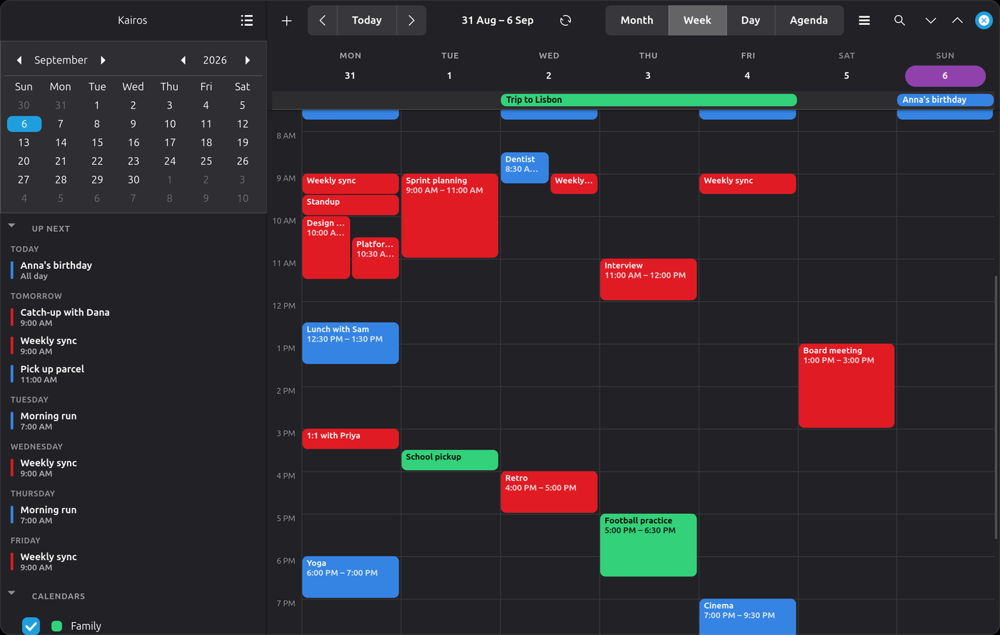
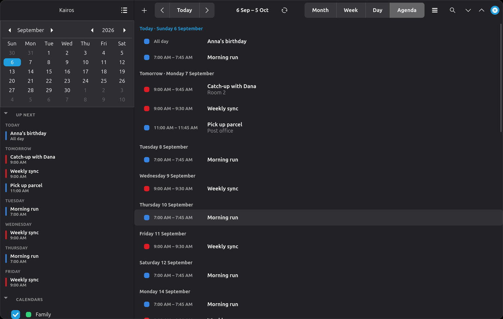
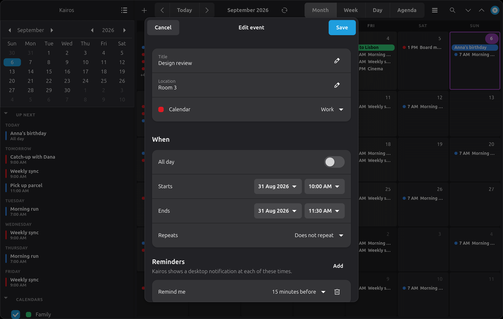

# User guide

- [The window](#the-window)
- [The sidebar](#the-sidebar)
- [Searching](#searching)
- [Views](#views)
- [Creating and editing events](#creating-and-editing-events)
- [Reminders](#reminders)
- [Running in the background](#running-in-the-background)
- [Keyboard shortcuts](#keyboard-shortcuts)
- [Gestures](#gestures)
- [What Kairos does not do](#what-kairos-does-not-do)

---

## The window

A sidebar on the left, the calendar on the right.

The header bar has, left to right: **+** for a new event, **‹ Today ›** for
moving about, the current period, a sync button, the view switcher, a search
button, and the main menu.

On a window narrower than 1000px the sidebar folds away behind a back button
and the view switcher becomes a dropdown, so the calendar keeps the space.

---

## The sidebar

Three parts, top to bottom.

**The month.** Click any date to jump to it. The day under the pointer is
highlighted so you can see what you are about to click.

**Up next.** The next handful of events in order, grouped under *Today*,
*Tomorrow* and then weekday names, each with its calendar's colour and its
time. Click one to open it. It answers "what is next?" without leaving
whichever view you are in.

By default it shows 8 events over the next 30 days; both are settings
(`sidebar_upcoming_count` and `sidebar_upcoming_days`), and the whole section
can be switched off with `sidebar_show_upcoming`. The agenda view is there for
the longer list.

**Calendars.** Each with a checkbox that shows or hides it. Hiding a calendar
only changes what you see — its reminders still arrive, and nothing is
deleted.

**Up next** and **Calendars** both have a disclosure triangle in their
heading: click it to fold the section away. Kairos remembers which sections
you left open.

---

## Searching

Press <kbd>Ctrl</kbd>+<kbd>F</kbd>, or the magnifying glass in the header, or
simply start typing in the calendar window.

Results replace the calendar while you search, each showing the calendar's
colour, the date, the title, and the time, place and calendar underneath.
Click one to jump to its day and open it. <kbd>Escape</kbd> closes the search
and puts you back in the view you came from.

Search covers an event's **title, location and notes**. A repeating event is
listed under its *next* occurrence rather than whenever the series began, and
results still to come are listed before ones in the past.

Words match from the **start**, so results narrow as you type: "cin" finds
"Cinema". It does not match the middle of a word — "ine" will not find
"Cinema" — because search is answered from an index rather than by reading
every event, which is what keeps it instant on a calendar of any size. Typing
several words finds events matching all of them.

---

## Views

Four of them, switchable with <kbd>Ctrl</kbd>+<kbd>1</kbd> to
<kbd>Ctrl</kbd>+<kbd>4</kbd>.

**Month** — six weeks at a time. Each day shows a few events and then
"+N more"; how many is [configurable](configuration.md). Timed events appear
as a coloured dot with the time; all-day and multi-day events as a solid bar
across the days they cover.

**Week** and **Day** — a timed grid. Events sit at their real times, and
overlapping ones are placed side by side automatically. A line across the grid
shows the current time. The view opens scrolled to about an hour before now
rather than at midnight.

All-day events sit in a strip above the grid. An event covering several days
is drawn as **one bar across exactly those days**, not repeated in each one,
and keeps the same line all the way along; a bar reaching past the edge of the
week is cut off at it. Where bars overlap they stack, longest at the top.

**Drag a block** to move an event, or pull its bottom edge to change when it
ends. Drag sideways to put it on another day, and up or down to change the
time — as far as you like, in five-minute steps. An all-day banner can be
dragged between days too.

While you drag, the event you picked up dims and a dashed outline shows
where it will land, labelled with the time it would start — and the weekday
as well, once you have dragged it out of the day it began in. Nothing is
saved until you let go.

An event cannot be dragged out of the day it would land on, or shortened
past its own start. Dragging one occurrence of a repeating event asks which
occurrences you meant, exactly as the editor does; cancelling puts it back.

**Agenda** — a plain list of what is coming, day by day, skipping empty days.
The most useful view in a narrow window.

Click a day heading in the week view, or "+N more" in the month view, to jump
to that day.

---

## Creating and editing events

**To create one**: press **+**, or <kbd>Ctrl</kbd>+<kbd>N</kbd>, or
double-click a day in the month view or a time in the week view. Double-clicking
puts the event where you clicked.

**To open one**: click it. A bubble appears with the details and **Edit** and
**Delete**. If the event has a link — in its **Link** field, its location, or
anywhere in its notes — there is a **Join** button too, which opens it in your
browser. Only `http` and `https` links are ever offered; see
[security](security.md).

The editor has:

- **Title**, **Location**, **Link** and **Notes**
- **Calendar** — which calendar it belongs to. Read-only calendars are not offered.
- **All day** — hides the times and switches to whole days. The end date shown
  is the last day the event covers, which is what people mean, even though
  iCalendar stores it differently underneath.
- **Starts** / **Ends** — a date button and a time button. In 12-hour mode the
  time picker offers 1–12 with AM/PM; in 24-hour mode, 0–23.
- **Repeats** — daily, weekly, fortnightly, monthly, yearly, or every weekday.
  A rule from a server that Kairos cannot express is preserved untouched and
  shown as "(from the server)".
- **Reminders** — any number; see below.

Pressing <kbd>Enter</kbd> in the title field saves.

**Repeating events** ask before an edit or a delete whether you mean *this
event*, *this and following*, or *all events*. Changing one occurrence leaves
the rest alone; "this and following" ends the old series at that date and
starts a new one from it, which is how every other calendar does it and what
lets the earlier occurrences keep their old details.

**Deleting can be undone.** A bar appears at the bottom of the window with an
**Undo** button for a few seconds afterwards — for a whole event, and for a
single occurrence of a repeating one.

### Times and timezones

Events are always shown on your clock. A server usually stores events in UTC,
so a 7pm meeting in New York is stored as 11pm UTC; Kairos converts on the way
in. Editing such an event and saving it rewrites the start in your timezone —
the same instant, spelled differently.

---

## Reminders

Each event carries its own reminders, and each is an offset before the start.
The dropdown lists the usual ones; **Custom…** takes any number of minutes,
hours, days or weeks. An offset that came from another client — five days,
say — is shown in the list in words, whether or not Kairos would have offered
it.

A due reminder arrives twice over:

- a **desktop notification**, as any application would send; and
- an **alert window** that asks your desktop to bring it to the front, even
  when Kairos is in the background or its window is closed.

The second exists because a notification slides away after a few seconds and
is very easy to miss. The window stays until you answer it:

- **Snooze** — 5 minutes to tomorrow. Snoozes are remembered on disk, so
  "remind me in an hour" survives closing Kairos or suspending the machine.
- **Dismiss** — done with it.
- **Show in calendar** — opens Kairos on that day.

Reminders that fall due together share one window rather than opening several.

If you would rather have notifications alone, turn off *Show an alert window*
in **Preferences → Reminders**. That page also has **Send a test reminder**,
which fires a real one through both routes — the quickest way to find out what
your desktop actually permits.

> Whether the window really takes focus is your desktop's decision, not
> Kairos's. See [troubleshooting](troubleshooting.md#the-alert-window-opens-behind-what-i-am-doing).

---

## Running in the background

A calendar that is not running cannot remind you of anything, so by default
closing the window does not quit Kairos. It carries on in the taskbar, syncing
and firing reminders.

**The taskbar icon** has a menu: *Open Kairos*, *New event*, *Sync now* and
*Quit Kairos*. Clicking the icon shows the window, raises it if it is behind
something, and hides it again if it is already in front. Not every desktop has a
system tray — GNOME needs an extension — and where there is none the icon
simply does not appear; Kairos still runs, and launching it again from your
applications menu brings the window back.

**To quit properly**: <kbd>Ctrl</kbd>+<kbd>Q</kbd>, or *Quit Kairos* from the
tray menu.

**To have it start with your session**: Preferences → General → Running →
*Start automatically when you log in*. That writes
`~/.config/autostart/org.kairos.Calendar.desktop`, which starts Kairos in the
background so you get reminders without a window appearing in your face.

**To go back to ordinary behaviour**: turn off *Keep running when the window
is closed* in the same place, and closing the window will quit.

---

## Keyboard shortcuts

| | |
|---|---|
| <kbd>Ctrl</kbd>+<kbd>N</kbd> | New event |
| <kbd>Ctrl</kbd>+<kbd>F</kbd> | Search events |
| <kbd>Ctrl</kbd>+<kbd>T</kbd> | Go to today |
| <kbd>Ctrl</kbd>+<kbd>R</kbd> or <kbd>F5</kbd> | Sync now |
| <kbd>Ctrl</kbd>+<kbd>1</kbd> … <kbd>Ctrl</kbd>+<kbd>4</kbd> | Month, week, day, agenda |
| <kbd>Alt</kbd>+<kbd>←</kbd> / <kbd>→</kbd> | Previous / next period |
| <kbd>Ctrl</kbd>+<kbd>Page Up</kbd> / <kbd>Page Down</kbd> | The same |
| <kbd>Ctrl</kbd>+<kbd>L</kbd> | Manage calendars |
| <kbd>Ctrl</kbd>+<kbd>,</kbd> | Preferences |
| <kbd>Ctrl</kbd>+<kbd>W</kbd> | Close the window |
| <kbd>Ctrl</kbd>+<kbd>Q</kbd> | Quit |

### In the month grid

Click a day, or <kbd>Tab</kbd> to the grid, and then:

| | |
|---|---|
| <kbd>←</kbd> <kbd>→</kbd> | Previous / next day |
| <kbd>↑</kbd> <kbd>↓</kbd> | Same day last / next week |
| <kbd>Home</kbd> / <kbd>End</kbd> | First / last day of the week |
| <kbd>Page Up</kbd> / <kbd>Page Down</kbd> | Same day last / next month |
| <kbd>Enter</kbd> or <kbd>Space</kbd> | Open that day |

Walking off the edge of the month brings the next one in rather than stopping.
Each day announces its date and how many events it has, so the grid can be
used with a screen reader.

They are all in one table at the top of
[`kairos/app.py`](../kairos/app.py) if you want different ones.

---

## Gestures

Swipe left or right — two fingers on a touchpad, or a flick on a touchscreen —
to move to the next or previous period, in whatever unit the view is showing.
Vertical scrolling is untouched, and one swipe moves one period however hard
you flick.

---

## What Kairos does not do

Stated plainly, because finding out later is annoying:

- **"This and all future events" is not offered.** Editing a repeating event
  changes either one occurrence or the entire series; there is no third
  option that splits it at a date.
- **No tasks or notes** (VTODO, VJOURNAL). Calendars holding only tasks are
  skipped when an account is added.
- **No invitations, attendees, RSVPs or free/busy.** Kairos reads and writes
  events; it does not do scheduling.
- **No timezone editor.** Events are read in their own timezone and shown in
  yours, but you cannot author an event *in* another timezone.
- **Custom repeat rules are read, not composed.** A rule outside the presets
  is preserved but cannot be built in the interface.
- **No year view**, so swiping never moves a whole year.
- **The sidebar month starts its week where your system locale says**, which
  can differ from the main grid if you have overridden *Week starts on*. GTK's
  calendar widget has no setting for it.
